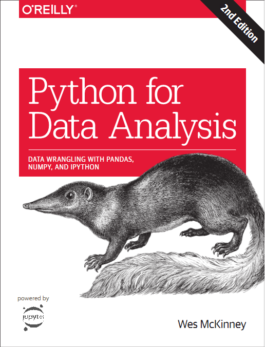

# 利用 Python 进行数据分析 · 第 2 版



> 译者：[SeanCheney](https://github.com/iamseancheney)
> 
> 欢迎任何人参与和完善：一个人可以走的很快，但是一群人却可以走的更远。

+   [在线阅读](https://pyda.apachecn.org)
+   [ApacheCN 机器学习交流群 629470233](http://shang.qq.com/wpa/qunwpa?idkey=30e5f1123a79867570f665aa3a483ca404b1c3f77737bc01ec520ed5f078ddef)
+   [ApacheCN 学习资源](http://www.apachecn.org/)
+   [Sklearn 与 TensorFlow 机器学习实用指南](https://github.com/it-ebooks/hands-on-ml-2e-zh)

&zwj;

+ [在线阅读](https://www.gitbook.com/book/wizardforcel/pyda-2e/details)
+ [在线阅读（Gitee）](https://apachecn.gitee.io/pyda-2e-zh/)
+ [PDF格式](https://www.gitbook.com/download/pdf/book/wizardforcel/pyda-2e)
+ [EPUB格式](https://www.gitbook.com/download/epub/book/wizardforcel/pyda-2e)
+ [MOBI格式](https://www.gitbook.com/download/mobi/book/wizardforcel/pyda-2e)
+ [代码仓库](https://github.com/apachecn/pyda-2e-zh)

下载本书代码（本书GitHub地址）：[https://github.com/wesm/pydata-book](https://github.com/wesm/pydata-book) （建议把代码下载下来之后，安装好Anaconda 3.6，在目录文件夹中用Jupyter notebook打开）

本书是2017年10月20号正式出版的，和第1版的不同之处有：

* 包括Python教程内的所有代码升级为Python 3.6（第1版使用的是Python 2.7）
* 更新了Anaconda和其它包的Python安装方法
* 更新了Pandas为2017最新版
* 新增了一章，关于更高级的Pandas工具，外加一些tips
* 简要介绍了使用StatsModels和scikit-learn

对有些内容进行了重新排版。（译者注1：最大的改变是把第1版附录中的Python教程，单列成了现在的第2章和第3章，并且进行了扩充。可以说，本书第2版对新手更为友好了！）

（译者注2：毫无疑问，本书是学习Python数据分析最好的参考书。本来想把书名直接译为《Python数据分析》，这样更简短。但是为了尊重第1版的翻译，考虑到继承性，还是用老书名。这样读过第一版的老读者可以方便的用之前的书名检索到第二版。作者在写第二版的时候，有些文字是照搬第一版的。所以第二版的翻译也借鉴copy了第一版翻译：即，如果第二版中有和第一版相同的文字，则copy第一版的中文译本，觉得不妥的地方会稍加修改，剩下的不同的内容就自己翻译。这样做也是为读过第一版的老读者考虑——相同的内容可以直接跳过。）


## 下载

### Docker

```
docker pull apachecn0/pyda-2e-zh
docker run -tid -p <port>:80 apachecn0/pyda-2e-zh
# 访问 http://localhost:{port} 查看文档
```

### PYPI

```
pip install pyda-2e-zh
pyda-2e-zh <port>
# 访问 http://localhost:{port} 查看文档
```

### NPM

```
npm install -g pyda-2e-zh
pyda-2e-zh <port>
# 访问 http://localhost:{port} 查看文档
```
